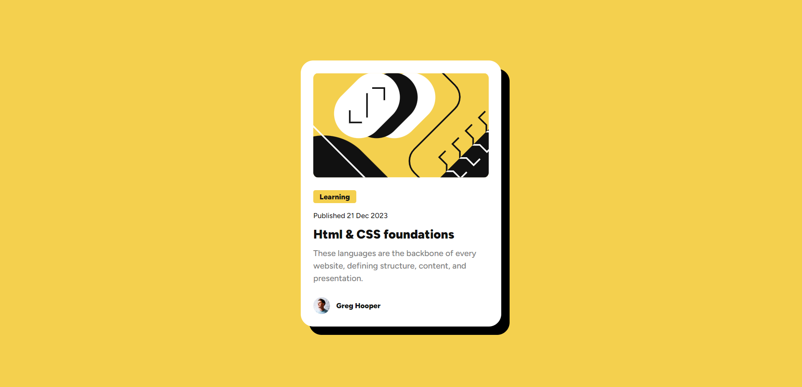

# Responsive Blog Preview Card UI Design

This is a solution to the [Blog preview card challenge on Frontend Mentor](https://www.frontendmentor.io/challenges/blog-preview-card-ckPaj01IcS). Frontend Mentor challenges help you improve your coding skills by building realistic projects.

## Table of contents

- [Overview](#overview)
  - [The challenge](#the-challenge)
  - [Screenshot](#screenshot)
  - [Links](#links)
- [My process](#my-process)
  - [Built with](#built-with)
  - [What I learned](#what-i-learned)
- [Author](#author)
- [Acknowledgments](#acknowledgments)

## Overview

### The challenge

Users should be able to:

- See hover and focus states for all interactive elements on the page
- Use keyboard tab button to navigate elements
- See from any smaller to larger devices easily

### Screenshot



### Links

- Solution URL: [Code Link Here](https://github.com/AskatAsh/Responsive-Web-Components/tree/main/CSS%20-%20Blog-Preview-Card)
- Live Site URL: [Add live site URL here](https://your-live-site-url.com)

## My process

### Built with

- Semantic HTML5 markup
- CSS custom properties
- Flexbox
- CSS Media Query
- Mobile-first workflow
- Web Accessibilty

### What I learned

Doing this project I learned

- About html semantic elements
- CSS focus and hover state
- Web accessibility and Html tabindex attribute
- CSS media query for different viewports

To see what I learned and used, see below:

```html
<article>
  <strong id="category" tabindex="2">Learning</strong>

  <p id="publish-date" tabindex="3">Published 21 Dec 2023</p>

  <h2 id="blog-title">
    <a href="" target="_blank" tabindex="4">Html & CSS foundations</a>
  </h2>

  <p id="blog-para" tabindex="5">
    These languages are the backbone of every website, defining structure,
    content, and presentation.
  </p>
</article>
```

```css
@media screen and (max-width: 426px) {
    #card-container{
        max-width: 327px;
        margin: 1.5rem;
        box-shadow: 8px 8px #000;
    }
}
```

## Author

- GitHub - [M. A. Askat](https://github.com/AskatAsh)
- Frontend Mentor - [@AskatAsh](https://www.frontendmentor.io/profile/AskatAsh)

**Note: Delete this note and add/remove/edit lines above based on what links you'd like to share.**

## Acknowledgments

I want to thank [Frontend Mentor](https://www.frontendmentor.io) to make it possible for us to practice and hone our skills sharing us with free resources and designs.
