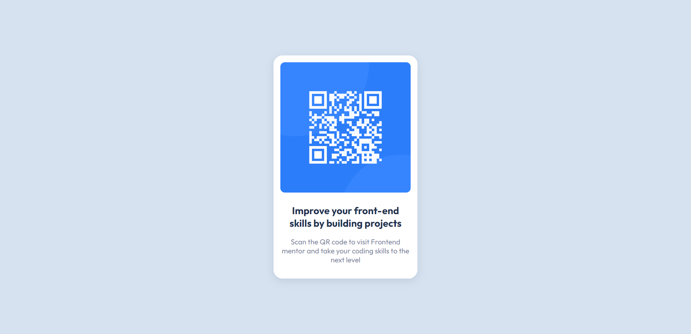

# Responsive QR code component using Html and CSS

This is a solution to the [QR code component challenge on Frontend Mentor](https://www.frontendmentor.io/challenges/qr-code-component-iux_sIO_H). Frontend Mentor challenges help you improve your coding skills by building realistic projects. 

## Table of contents

- [Overview](#overview)
  - [Screenshot](#screenshot)
  - [Links](#links)
- [My process](#my-process)
  - [Built with](#built-with)
  - [What I learned](#what-i-learned)
  - [Continued development](#continued-development)
  - [Useful resources](#useful-resources)
- [Author](#author)
- [Acknowledgments](#acknowledgments)

**Note: Delete this note and update the table of contents based on what sections you keep.**

## Overview

### Screenshot




### Links

- Solution URL: [Code link](https://github.com/AskatAsh/Responsive-Web-Components/tree/main/CSS%20-%20Responsive%20QR%20Code)
- Live Site URL: [Live site link](https://responsive-qrcode-component.netlify.app/)

## My process

### Built with

- Semantic HTML5 markup
- CSS custom properties
- Flexbox
- CSS Media Query
- Mobile-first workflow


### What I learned

I learned how to use flexbox property to center an element and I also used flexbox to center an image in a container.

To see how I used the above mentioned concepts, see below:

```css
body{
    display: flex;
    align-items: center;
    justify-content: center;
    min-height: 100vh;
    background-color: #d6e2f0;
}
#image-container{
    max-width: 100%;
    border-radius: 10px;
    display: flex;
    align-items: center;
    justify-content: center;
    overflow: hidden;
}
#image-container img{
    max-width: 100%;
    object-fit: cover;
}
```
I also used css media query to make sure the component fits properly in different viewport sizes.
```css
@media screen and (max-width: 375px) {
    #card-container{
        margin: 8px;
    }
}
```

## Author

- GitHub - [M. A. Askat](https://github.com/AskatAsh)
- Frontend Mentor - [@AskatAsh](https://www.frontendmentor.io/profile/AskatAsh)


## Acknowledgments

I want to thank [Frontend Mentor](https://www.frontendmentor.io) to make it possible for us to practice and hone our skills sharing us with free resources and designs.
